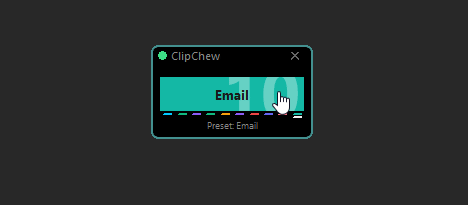
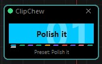
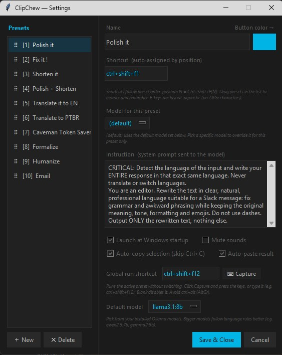

<p align="center">
  
</p>

# ClipChew 🐊

🇺🇸 **[Read in English →](README.md)**

**Mastiga. Processa. Cola.**

Um pequeno botão flutuante para Windows que reescreve qualquer texto que você copiar — melhora, encurta, traduz, corrige — usando um **modelo de IA local**. Nada sai do seu computador: sem nuvem, sem contas, sem chaves de API.

Digite uma mensagem no Slack, copie, aperte um atalho, e o ClipChew coloca a versão melhorada de volta na sua área de transferência, pronta para colar.

<p align="center">
  
</p>

---

## Sumário

- [Requisitos](#requisitos)
- [Instalação](#instalação)
  - [Passo 1 — Instalar o Python](#passo-1--instalar-o-python)
  - [Passo 2 — Instalar os complementos do Python](#passo-2--instalar-os-complementos-do-python-que-o-clipchew-precisa)
  - [Passo 3 — Instalar o Ollama e um modelo](#passo-3--instalar-o-ollama-e-baixar-um-modelo-de-ia)
  - [Passo 4 — Baixar e rodar o ClipChew](#passo-4--baixar-e-rodar-o-clipchew)
- [Como usar](#como-usar)
- [Configurações](#configurações)
- [Escolhendo um modelo](#escolhendo-um-modelo)
- [Solução de problemas](#solução-de-problemas)
- [Privacidade](#privacidade)
- [Para desenvolvedores](#para-desenvolvedores)
- [Licença](#licença)

---

## Requisitos

| O quê | Detalhes |
|---|---|
| **Sistema** | Windows 10 ou 11 |
| **Python** | 3.9+ (com "Add to PATH" marcado) |
| **Pacotes Python** | `requests`, `pyperclip`, `keyboard`, `pillow` |
| **Ollama** | Instalado e rodando ([ollama.com](https://ollama.com/download)) |
| **Um modelo do Ollama** | Qualquer modelo que você tenha baixado — o ClipChew funciona com **qualquer modelo instalado no Ollama**. Recomenda-se um modelo pequeno e rápido (veja [Escolhendo um modelo](#escolhendo-um-modelo)). |
| **Espaço em disco** | ~3–5 GB para um modelo pequeno |
| **Tempo de instalação** | ~10 minutos, uma única vez |

> O ClipChew **não** está preso a nenhum modelo específico. Tudo que você baixar com `ollama pull` aparece nas Configurações e você pode trocar livremente — até por preset.

---

## Instalação

Você vai instalar três coisas: o **Python**, o **Ollama** (o motor de IA local) e o **ClipChew** em si. É só seguir os passos na ordem.

---

## Passo 1 — Instalar o Python

1. Acesse **https://www.python.org/downloads/** e clique no grande botão amarelo **Download Python**.
2. Execute o instalador.
3. **IMPORTANTE:** na primeira tela, marque a caixinha **"Add python.exe to PATH"** lá embaixo, e então clique em **Install Now**.
4. Quando terminar, clique em **Close**.

Para confirmar que funcionou: abra o **menu Iniciar**, digite `cmd`, aperte Enter, e na janela preta digite:

```
python --version
```

Você deve ver algo como `Python 3.12.x`.

---

## Passo 2 — Instalar os complementos do Python que o ClipChew precisa

Naquela mesma janela preta (Prompt de Comando), cole esta linha e aperte Enter:

```
pip install requests pyperclip keyboard pillow
```

Espere terminar (você verá "Successfully installed ...").

---

## Passo 3 — Instalar o Ollama e baixar um modelo de IA

O Ollama é o programa gratuito que roda a IA na sua própria máquina.

1. Acesse **https://ollama.com/download** e baixe a versão para **Windows**.
2. Execute o instalador e siga as instruções. Quando terminar, o Ollama roda discretamente em segundo plano (procure o ícone dele perto do relógio).
3. Agora baixe um modelo de IA. Abra o Prompt de Comando de novo e rode:

```
ollama pull gemma3:4b
```

Isso baixa alguns GB — dê um minuto. Quando terminar, o ClipChew está pronto para pensar.

> **Quer resultados melhores?** Modelos maiores seguem instruções (como manter o idioma original) com mais consistência. Se o seu PC aguentar, experimente:
> ```
> ollama pull qwen2.5:7b
> ```
> Você pode alternar entre os modelos instalados depois, direto nas Configurações do ClipChew.

---

## Passo 4 — Baixar e rodar o ClipChew

1. Baixe este projeto (botão verde **Code** → **Download ZIP**) e descompacte onde quiser, por exemplo `Documentos\ClipChew`.
2. Abra essa pasta e **dê dois cliques em `ClipChew.bat`**.

Um pequeno botão flutuante aparece na sua tela. É isso! 🎉

> A bolinha no botão fica **verde** quando a IA está pronta e **vermelha** se o Ollama não estiver rodando.

---

## Como usar

1. **Selecione** um texto em qualquer aplicativo (Slack, e-mail, navegador…).
2. Aperte um **atalho** — `Ctrl+Shift+F1`, `F2`, `F3`… cada um é um preset diferente.
3. O ClipChew copia sua seleção, reescreve e coloca o resultado de volta na área de transferência.
4. Aperte **`Ctrl+V`** para colar a versão melhorada.

Você também pode **clicar no botão** para rodar o preset atual, ou **girar a rodinha do mouse** sobre ele para trocar de preset.

### Os presets que já vêm prontos

| Atalho | Preset | O que faz |
|---|---|---|
| `Ctrl+Shift+F1` | Polish it | Reescrita limpa, natural e profissional |
| `Ctrl+Shift+F2` | Fix it! | Corrige gramática, ortografia e erros de digitação |
| `Ctrl+Shift+F3` | Shorten it | Deixa mais curto e enxuto |
| `Ctrl+Shift+F4` | Polish + Shorten | Os dois ao mesmo tempo |
| `Ctrl+Shift+F5` | Translate to EN | Traduz para o inglês |
| `Ctrl+Shift+F6` | Translate to PT-BR | Traduz para o português do Brasil |
| `Ctrl+Shift+F7` | Caveman Token Saver | Inglês técnico ultracurto |
| `Ctrl+Shift+F8` | Formalize | Mais formal e educado |
| `Ctrl+Shift+F9` | Humanize | Soa como uma pessoa de verdade |
| `Ctrl+Shift+F10` | Email | Formata como um e-mail completo |
| `Ctrl+Shift+F12` | (Execução global) | Roda o preset que estiver ativo |

> A maioria dos presets mantém o **idioma original** do seu texto — escreva em inglês, recebe em inglês; escreva em português, recebe em português.

---

## Configurações

**Clique com o botão direito** no botão → **Settings…** para:

- Adicionar, editar, excluir e **arrastar para reordenar** presets (o número do atalho acompanha a posição)
- Escrever suas próprias instruções de IA para cada preset
- Escolher uma **cor de botão** por preset
- Escolher qual **modelo do Ollama** usar
- Ligar/desligar o **auto-copy** / **auto-paste**
- Definir o atalho de **execução global**
- Iniciar o ClipChew automaticamente junto com o Windows

<p align="center">
  
</p>

---

## Escolhendo um modelo

O ClipChew roda com **qualquer modelo instalado no Ollama** — basta dar `ollama pull` nele e selecioná-lo nas Configurações. O trade-off é simples: **menor = respostas mais rápidas**, **maior = segue melhor as instruções** (especialmente o "manter o idioma original").

Para reescritas ágeis, quase instantâneas num notebook comum, comece com um modelo **leve**:

| Modelo | Comando | Observações |
|---|---|---|
| **Gemma 3 1B** | `ollama pull gemma3:1b` | Minúsculo e muito rápido — ótimo para correções/encurtamentos rápidos. |
| **Llama 3.2 3B** | `ollama pull llama3.2:3b` | Rápido e equilibrado como padrão. |
| **Gemma 3 4B** | `ollama pull gemma3:4b` | O equilíbrio recomendado entre velocidade e qualidade. |
| **Qwen 2.5 7B** | `ollama pull qwen2.5:7b` | O que melhor segue instruções aqui; precisa de um pouco mais de RAM/tempo. |

**Dica:** você pode atribuir um modelo diferente para cada preset. Use um modelo minúsculo no "Shorten it" / "Fix it!" (onde a velocidade importa), e um maior no "Email" ou "Translate" (onde a qualidade importa). Defina o modelo padrão — e as exceções por preset — nas **Configurações**.

---

## Solução de problemas

**A bolinha está vermelha / "Ollama offline"**
O Ollama não está rodando. Abra o menu Iniciar, execute o **Ollama** e espere alguns segundos. Confira se você fez o Passo 3.

**Os atalhos não fazem nada**
Garanta que só há uma cópia do ClipChew rodando (confira no Gerenciador de Tarefas por `python.exe` / `pythonw.exe`). Feche as extras e inicie de novo.

**Traduziu meu texto quando não devia**
Modelos pequenos às vezes escorregam. Abra as **Configurações** e troque para um modelo maior como `qwen2.5:7b` (depois de `ollama pull qwen2.5:7b`).

**Nada é copiado / "algum texto está selecionado?"**
Selecione o texto antes de apertar o atalho, e confira se o auto-copy está ligado nas Configurações.

---

## Privacidade

O ClipChew é **100% local**. Seu texto é processado pelo Ollama no seu próprio computador e nunca é enviado para lugar nenhum. Não há contas, telemetria ou chaves de API.

---

## Para desenvolvedores

O ClipChew é um único arquivo Python (`clipchew.py`) que usa apenas Tkinter e a API do Windows via `ctypes`.

Na primeira execução, o ClipChew cria seu próprio `config.json` a partir dos padrões embutidos — você não precisa distribuir um. Uma cópia de referência dos presets e configurações padrão fica em **`config.example.json`**, caso você queira inspecionar ou pré-configurar manualmente.

---

## Licença

O ClipChew é gratuito e de código aberto, distribuído sob a **GNU General Public License v3.0** (veja [`LICENSE`](LICENSE)). Você é livre para usar, estudar, modificar e compartilhar, desde que trabalhos derivados permaneçam sob a GPL.

**Licenciamento comercial:** Se você quiser usar o ClipChew em um produto proprietário / de código fechado sem as obrigações da GPL, há uma licença comercial separada disponível. Entre em contato com **Marcelo Souza** em marcelo@3donline.com.br.

---

Feito por Marcelo Souza · Movido a [Ollama](https://ollama.com)
